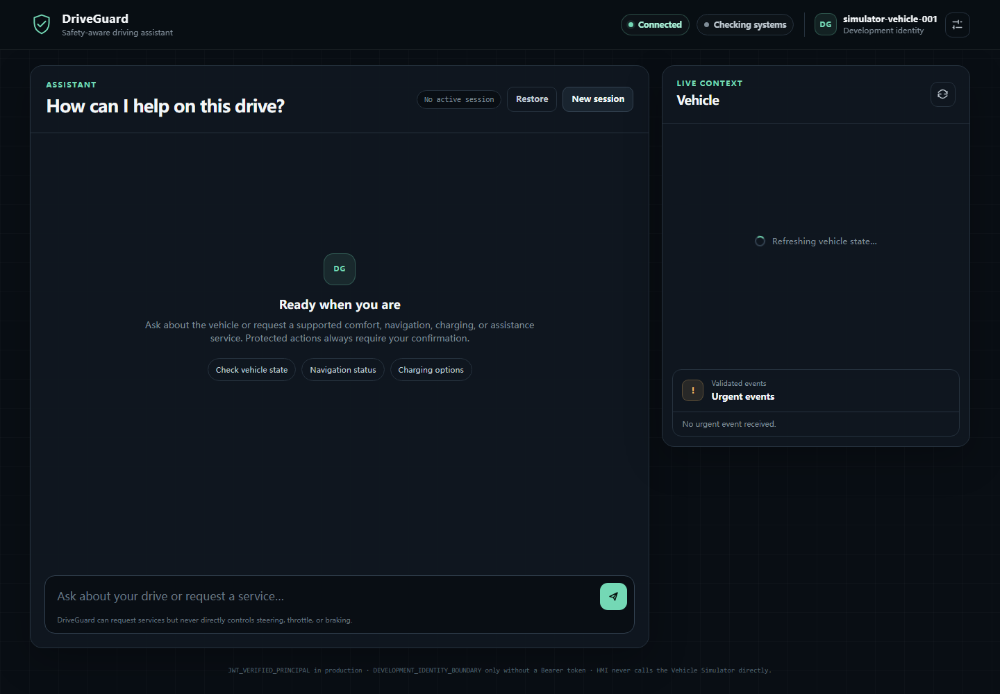

# DriveGuard

DriveGuard is a safety-aware driving-service orchestration runtime. It lets an LLM understand a
request and propose capabilities while deterministic software retains authority over validation,
policy, confirmation, execution, persistence, and audit. It is a simulator-backed engineering
project and is not evidence of deployment in a production vehicle or of commercial traffic.



## Architecture

```text
User / HMI
  -> JWT/JWKS authentication
  -> API and bounded admission control
  -> Agent Runtime
  -> Tool routing and schema validation
  -> deterministic Policy Engine
  -> confirmation/action state machine
  -> Reliable Executor
  -> vehicle simulator or external capability
  -> authoritative state refresh and execution receipt
  -> final response
```

PostgreSQL stores sessions, actions, execution/idempotency state, and audit records. Redis provides
bounded conversation memory. NATS JetStream carries durable urgent-event work. Prometheus and
Grafana expose health, capacity, reliability, and safety signals. See the
[final architecture](docs/architecture/final-architecture.md) for component and production-topology
details.

## Core features

- Pi-based Agent Runtime with deterministic capability filtering, argument validation, and bounded
  context.
- Explicit R0/R1/R2/RX risk handling. RX capabilities are never registered as LLM tools.
- Identity-bound confirmation lifecycle and reliable, idempotent side-effect execution.
- Recovery and reconciliation that do not blindly retry ambiguous writes.
- Bounded admission, per-vehicle serialization, backpressure, durable state, audit, and operational
  observability.
- JWT/JWKS production authentication, claim-backed vehicle authorization, internal networks, and
  least-privilege containers.

## Cockpit HMI

The responsive HMI presents the assistant conversation beside live vehicle, trip, charging, and
system-health state. It uses the real authenticated API, SSE stream, session, tool execution, and
confirmation endpoints. Protected actions appear in a dedicated R2 confirmation card with the
action, target, risk reason, lifecycle status, explicit confirm/cancel controls, and final execution
receipt. Connection loss, `SERVICE_BUSY`, authentication/session failures, stale-context replans,
and backend recovery are shown without manufacturing a successful result.

## Safety model

The LLM does not control steering, throttle, braking, AEB, ESC, or any other safety-critical vehicle
actuator. Every permitted side effect follows this invariant:

```text
LLM -> Tool Contract -> Policy -> Confirmation / Action State -> Reliable Executor -> Capability
```

The final acceptance evidence records Critical Policy Recall and Safety Enforcement at 100%, with
zero authentication bypass, confirmation bypass, forbidden action execution, duplicate side
effects, false success, cross-user execution, or cross-vehicle execution. These are measured
project-gate results, not a certification for real-vehicle deployment.

## Technology stack

- TypeScript 5.9 in strict mode, Node.js 22, npm workspaces
- `@earendil-works/pi-agent-core` and `@earendil-works/pi-ai`
- Fastify API and static HMI gateway
- PostgreSQL, Redis, and NATS JetStream
- Docker Compose, GitHub Actions, Vitest, ESLint, Prettier
- Prometheus and Grafana

## Quick start

Requirements: Node.js `>=22.19.0`, npm `10.9.4`, Docker Engine, and Docker Compose.

```bash
npm ci --ignore-scripts
npm run format
npm run lint
npm run typecheck
npm run build
npm test
```

For the development/staging Compose topology, provide synthetic local values; never commit them:

```bash
export POSTGRES_PASSWORD=local-postgres-password
export POSTGRES_APP_PASSWORD=local-application-password
export URGENT_CONFIRMATION_SECRET=local-urgent-confirmation-secret-at-least-32-characters
export DRIVEGUARD_IMAGE_TAG="$(git rev-parse HEAD)"
docker compose config --quiet
docker compose build api vehicle-simulator hmi
docker compose up -d --wait --wait-timeout 120
```

The automated staging lifecycle and recovery procedures are documented in the
[operations runbook](docs/operations.md). Tests mock the LLM provider by default; live-provider
evaluation is opt-in and requires `DEEPSEEK_API_KEY` only in the process environment.

## Production deployment

Production is a hardened Compose overlay. It requires a real deployment-specific JWT issuer,
audience, JWKS endpoint, allowed algorithm list, vehicle-scope claim, LLM provider, and secrets.
Only the HMI gateway is host-published; other services remain on internal networks.

```bash
docker compose -f docker-compose.yml -f docker-compose.production.yml config --quiet
docker compose -f docker-compose.yml -f docker-compose.production.yml up -d --no-build
```

Do not treat the example environment files as production values. Provision secrets through the
deployment environment and review [known limitations](docs/known-limitations.md) and the
[final production checklist](docs/final-acceptance.md) before release.

## Evaluation

The final frozen Native evaluation used complete 420-case development and 180-case holdout sets.
Case pass was 90.00% and 92.22%, respectively; tool recall/precision/selection, argument validity,
Policy, Critical Policy, and Safety Enforcement were all 100% on both sets. The separate official
CAR-bench result was 41.60% raw Pass@1 and 66.67% on the valid-only denominator; 47 upstream
infrastructure failures remain disclosed and were not promoted into passes.

## Performance

The qualified deterministic-provider production topology sustained 20 VU at 96.53 requests/s in
the Phase 14.2 load window. Controlled saturation was observed at 50 VU with 3,975 controlled 503s,
zero HTTP 500s, and zero external busy leaks. The frozen 30-minute Phase 15.2 soak accepted
140,297/140,297 requests at 77.936 requests/s with zero semantic mismatch or unexpected HTTP 500;
latency and throughput ratios were 0.983 and 1.019. These figures do not include external-provider
latency and must not be represented as public production capacity.

## Security

- Production verifies signed RS256/ES256 JWTs through JWKS and derives user identity from `sub`.
- Vehicle authorization is claim-backed; development identity headers are rejected in production.
- Runtime containers are non-root with read-only roots, `no-new-privileges`, and all capabilities
  dropped; network-isolated one-shot volume initializers retain only measured capabilities.
- Final controlled-source Gitleaks findings: 0. Reachable-history findings: 26, all individually
  triaged historical report matches, 0 unresolved.
- Final images: 0 Critical, 0 fixable Critical/High, 0 reachable or unclassified High, 0 image
  secrets, and 0 Critical/High misconfigurations. Each image retains 43 raw no-fixed-version High
  rows classified `NOT_REACHABLE`; this is not a claim of zero vulnerabilities.

## CI/CD

GitHub Actions runs reproducible installation, format, lint, typecheck, build, targeted safety and
full regression, npm audit, layout, three SHA-tagged image builds, Compose config, and Gitleaks.
Expensive load/soak/CAR/live-provider work remains outside PR CI and is bound to retained phase
evidence. Release candidates use full Git SHA tags. The annotated `v1.0.0` tag and GitHub Release
are permitted only for the exact final `main` SHA after its hosted workflow is green.

## Repository structure

```text
apps/          API and HMI
packages/      domain, context, tools, Policy, lifecycle, executor, persistence, Agent Runtime
services/      vehicle simulator
tests/         unit, contract, integration, and smoke tests
evals/         frozen datasets, runners, scorers, and reports
benchmarks/    reusable load and topology tools
infra/         Docker, migrations, observability, faults, and operations
docs/          architecture, ADRs, runbooks, and final acceptance documentation
```

Stage-only raw evidence stays on registered sibling worktrees under `DriveGuard_phase/<stage>` and
is excluded from source-only `main` integrations.

## Known limitations

DriveGuard depends on an external LLM for live planning; provider latency/rate limits are not part
of the deterministic capacity numbers. The validated actuator is a simulator, not real vehicle
hardware. Forty-five PostgreSQL/Redis tests are opt-in when their external services are absent.
The image exception set requires review when the base image, package versions, reachability, or
fixed-version availability changes. See [known limitations](docs/known-limitations.md) for impact,
mitigation, production relevance, and future work.

## Release status

Project = **COMPLETE** and Production Release Readiness = **READY** under the measured DriveGuard
project gate. This is a source release for a simulator-backed engineering project; it does not
claim registry publication, commercial traffic, real-vehicle deployment, or production-vehicle
certification. The GitHub tag and Release are the authoritative publication records.

- [Final acceptance matrix](docs/final-acceptance.md)
- [Final metrics](docs/final-metrics.md)
- [Release notes](RELEASE_NOTES.md)
- [Final report](docs/final-report.md)
- [License](LICENSE)
